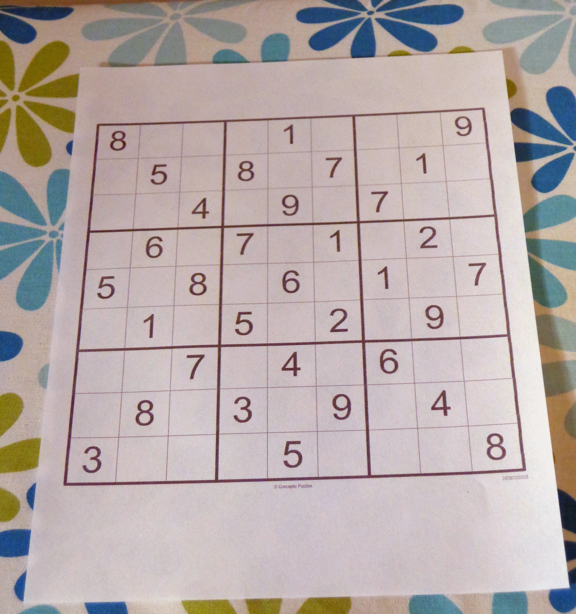
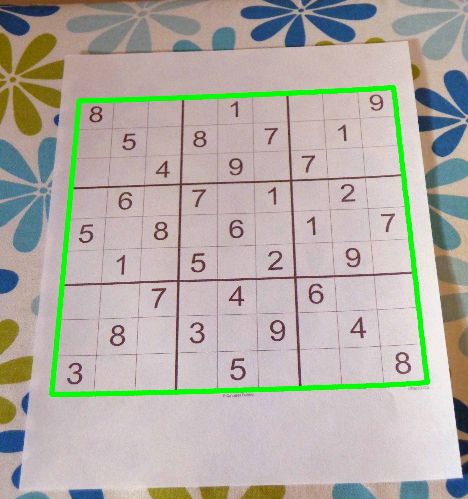
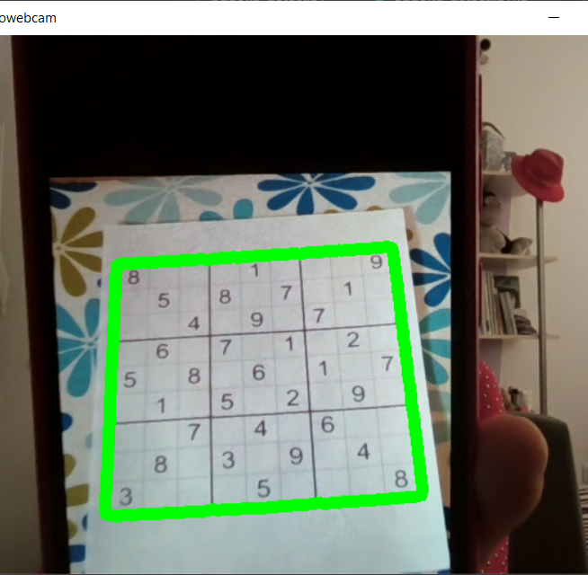
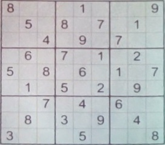

# Image_Processing_8
Salut les amis 😎

Tout d'abord, il faut installer ces librairies pour programmer ce projet :
(OpenCv, Matplotlib, Scipy, Imutils)  

## Sudoku_detect

après avoir reçu l'image d'un Sudoku, il peut bien detecter table du sudoko et afficher cette partie en couleur vert.

### la sortie:

Attention: pour gérer le document "Sudoku_detect.py" ,donnez l'adresse de l'image préféré à l'argument dans le terminal.

## sudoku_detector_video :

1. détecter chaque frame en webcam
2. remarquer les "contours" qui ont quatres côtés 
3. utiliser "four_point_transform()" pour recadrer la partie du sudoko  
4. appuyer 's' en clavier pour enregistrer l'image du sudoku

image enregistrée :

